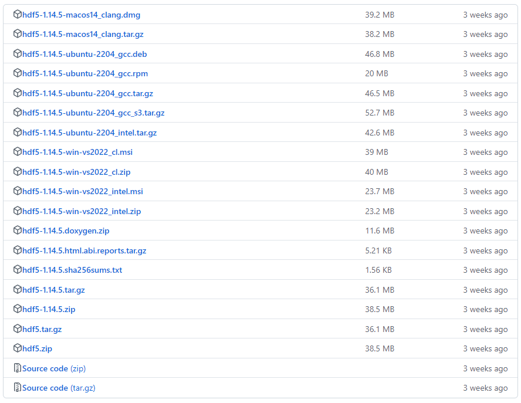

# HDF5使用总结

在VS中配置HDF5的步骤：
1. 官网下载编译好的HDF5包，可以看到官网有
   
   这些文件名和格式对应不同的平台、编译器以及安装需求。具体解释如下：

1. **macOS相关版本**
   - `hdf5-1.14.5-macos14_clang.dmg`: 针对macOS 14系统，通过Clang编译的HDF5库，`dmg`是macOS的应用安装镜像文件。
   - `hdf5-1.14.5-macos14_clang.tar.gz`: 针对macOS 14系统，通过Clang编译的HDF5库，压缩为`tar.gz`格式。

2. **Ubuntu相关版本**
   - `hdf5-1.14.5-ubuntu-2204_gcc.deb`: 针对Ubuntu 22.04，通过GCC编译的HDF5库，`.deb`是Ubuntu系统的安装包格式。
   - `hdf5-1.14.5-ubuntu-2204_gcc.rpm`: 针对Ubuntu 22.04，通过GCC编译的HDF5库，`.rpm`是另一种Linux安装包格式，通常用于RedHat系的发行版。
   - `hdf5-1.14.5-ubuntu-2204_gcc.tar.gz`: 针对Ubuntu 22.04，通过GCC编译的HDF5库，压缩为`tar.gz`格式。
   - `hdf5-1.14.5-ubuntu-2204_gcc_s3.tar.gz`: 同样是针对Ubuntu 22.04的版本，增加了对S3存储支持的HDF5库，`tar.gz`格式。
   - `hdf5-1.14.5-ubuntu-2204_intel.tar.gz`: 针对Ubuntu 22.04，通过Intel编译器编译的HDF5库，`tar.gz`格式。

3. **Windows相关版本**
   - `hdf5-1.14.5-win-vs2022_cl.msi`: 针对Windows平台，使用Visual Studio 2022编译器（`cl`）编译的HDF5库，`.msi`是Windows安装包格式。
   - `hdf5-1.14.5-win-vs2022_cl.zip`: 同样是通过Visual Studio 2022编译的HDF5库，压缩为`.zip`格式。
   - `hdf5-1.14.5-win-vs2022_intel.msi`: 针对Windows平台，使用Intel编译器编译的HDF5库，`.msi`安装包格式。
   - `hdf5-1.14.5-win-vs2022_intel.zip`: 使用Intel编译器的版本，压缩为`.zip`格式。

4. **文档与验证文件**
   - `hdf5-1.14.5.doxygen.zip`: 使用Doxygen生成的HDF5库的文档，`.zip`格式。
   - `hdf5-1.14.5.html.abi.reports.tar.gz`: ABI（Application Binary Interface）报告，压缩为`tar.gz`格式，文件较小，主要用于兼容性分析。
   - `hdf5-1.14.5.sha256sums.txt`: 用于校验文件完整性的SHA-256校验和文件。

5. **通用版本**
   - `hdf5-1.14.5.tar.gz`: 不指定平台的通用版本，压缩为`tar.gz`格式，适用于多平台编译和安装。
   - `hdf5-1.14.5.zip`: 与上一个类似，但压缩为`.zip`格式。

6. **源码**
   - `Source code (zip)` 和 `Source code (tar.gz)`: HDF5库的源代码，分别提供了`.zip`和`tar.gz`格式。

根据您的平台和需求，选择合适的版本来安装HDF5库。
2. 添加依赖
3. 设置预编译：`H5_BUILT_AS_DYNAMIC_LIB`